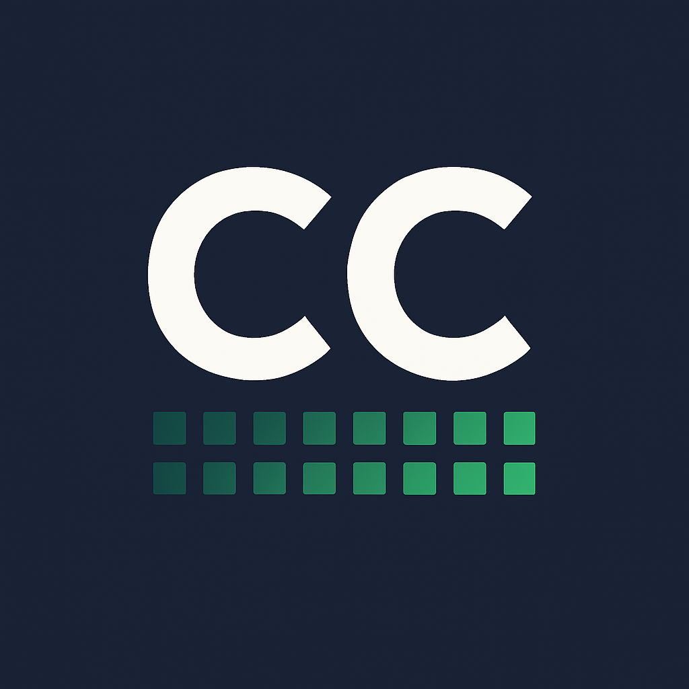
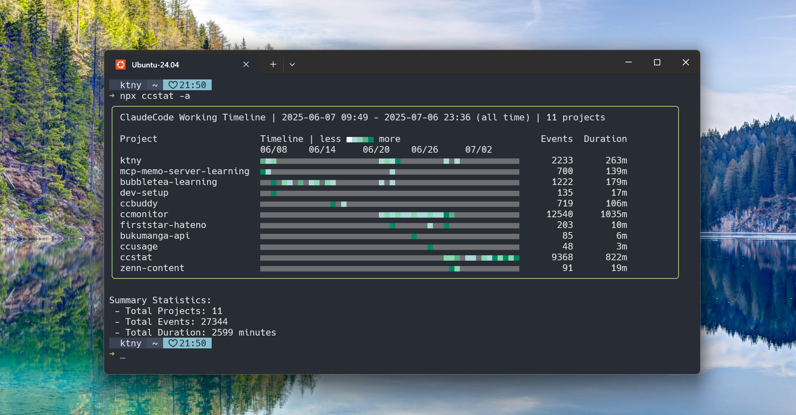

<div align="center">
  
</div>

# ccstat

> Visualize your Claude Code session activity timeline — fast, beautiful, and insightful!


## ✨ What is ccstat?

ccstat is a powerful CLI tool that analyzes your Claude Code session history and transforms it into beautiful timeline visualizations. Track your coding patterns and gain insights into your development workflow.



### 🎯 Key Features

- 📈 **Timeline Visualization** — Color-coded activity blocks showing your coding patterns
- ⏱️ **Smart Duration Tracking** — Calculates active work time with intelligent break detection
- 🎨 **Activity Density** — Five-level visual density indicators from idle to very high
- 📁 **Git Integration** — Automatically groups projects by repository
- 🌳 **Worktree Support** — Separate visualization for different worktree directories
- 🕐 **Flexible Time Ranges** — View activity by days (1+) or hours (1-24)
- 🔍 **Project Filtering** — Focus on specific projects
- ⚡ **High Performance** — Optimized file processing for fast results

## 🚀 Installation

### Quick Install (Recommended)

Install the latest version with a single command:

```bash
# Using curl
curl -fsSL https://ktny.github.io/ccstat/install.sh | sh
```

The installer automatically:
- Detects your OS and architecture
- Downloads the appropriate binary
- Installs to `/usr/local/bin` (with sudo) or `~/.local/bin` (without sudo)
- Verifies the installation

For specific versions or custom installation paths:
```bash
# Install specific version
curl -fsSL https://ktny.github.io/ccstat/install.sh | sh -s -- --version v0.1.3

# Install to custom directory
curl -fsSL https://ktny.github.io/ccstat/install.sh | sh -s -- --prefix $HOME/bin
```

### Option 1: Download Pre-built Binary (Manual)

Download the latest release binary for your platform from [GitHub Releases](https://github.com/ktny/ccstat/releases):

```bash
# Linux (x86_64)
wget https://github.com/ktny/ccstat/releases/download/v0.1.3/ccstat-v0.1.3-linux-amd64
chmod +x ccstat-v0.1.3-linux-amd64
sudo mv ccstat-v0.1.3-linux-amd64 /usr/local/bin/ccstat

# macOS (Apple Silicon)
wget https://github.com/ktny/ccstat/releases/download/v0.1.3/ccstat-v0.1.3-darwin-arm64
chmod +x ccstat-v0.1.3-darwin-arm64
sudo mv ccstat-v0.1.3-darwin-arm64 /usr/local/bin/ccstat

# macOS (Intel)
wget https://github.com/ktny/ccstat/releases/download/v0.1.3/ccstat-v0.1.3-darwin-amd64
chmod +x ccstat-v0.1.3-darwin-amd64
sudo mv ccstat-v0.1.3-darwin-amd64 /usr/local/bin/ccstat

```

### Option 2: Go Install (Latest Stable)

```bash
go install github.com/ktny/ccstat/cmd/ccstat@v0.1.3
```

### Option 3: Build from Source

```bash
git clone https://github.com/ktny/ccstat.git
cd ccstat
make build
./bin/ccstat
```

### Option 4: Development Installation

```bash
git clone https://github.com/ktny/ccstat.git
cd ccstat
make install  # Installs to $GOPATH/bin
```

## 📖 Usage

### Basic Commands

```bash
# View last 24 hours of activity
ccstat

# View last 7 days
ccstat --days 7

# View last 6 hours
ccstat --hours 6

# Filter by specific project
ccstat --project myproject

# Show worktree view (separate repos)
ccstat --worktree

# Combine options
ccstat --days 3 --project myproject --worktree
```

### Understanding the Output

#### 📊 Project Activity Table
- **Project**: Git repository name or directory name
- **Timeline**: Visual activity timeline with color-coded density
- **Events**: Number of messages in the session
- **Duration**: Active work time in minutes

#### ⏰ Time Axis Display
- **Hours view**: 15min/30min/1h/2h/3h/4h intervals
- **Single day**: Hour markers (0, 6, 12, 18)
- **Multiple days**: Date intervals

### 🧠 Smart Features

**Active Time Calculation**: Only counts periods where message intervals are ≤1 minute as active time, excluding long breaks to measure actual work time.

**Git Integration**: Automatically detects and groups projects by Git repository, showing parent-child relationships for complex project structures.

## 📋 Requirements

- **Go 1.21+** for building from source
- **Claude Code** for generating session logs
- **Git** (recommended) for project integration features

## 🖥️ Supported Platforms

- Linux (x86_64, ARM64)
- macOS (Intel, Apple Silicon)
- **Note**: Windows is not currently supported

## 📄 License

This project is licensed under the MIT License - see the [LICENSE](LICENSE) file for details.

---

<div align="center">
  <sub>Built with ❤️ for the Claude Code community</sub>
</div>
